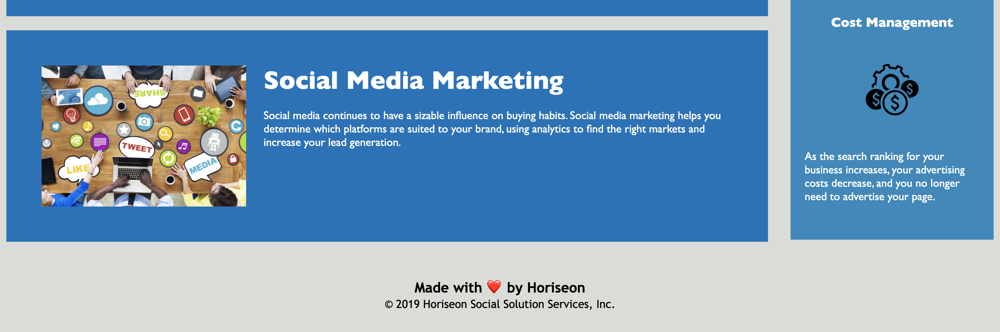

# code-refactor
Week 1 Homework

## Horiseon's Page Code Refactor

[Deployed Application Link](https://melaniede.github.io/code-refactor/)

## Summary
The Horiseon's marketing website was refactored to make the site more accessibility friendly, ensure all links were working properly, and the code was streamlined.

## Changes made to this project included:
- Added alt text to images 
- Added footer tag
- Updated title to describe website’s content
- Updated heading tags to go in order from h1 to h6
- Created ID to properly link Search Engine Optimization in Nav to the Search Engine Optimization section
- Added header tag
- Added nav tag
- Moved benefit section css code to align with placement in the html file 
- Changed sidebar div to aside tag
- Changed middle content divs to sections
- Consolidated class tags
- Moved background image from the css file to html file to add an alt text


### Top of the Page


### Middle of the Page


### Borrom of the Page



### User Story
```
AS A marketing agency
I WANT a codebase that follows accessibility standards
SO THAT our own site is optimized for search engines
```
### Acceptance Criteria
```
GIVEN a webpage meets accessibility standards
WHEN I view the source code
THEN I find semantic HTML elements
WHEN I view the structure of the HTML elements
THEN I find that the elements follow a logical structure independent of styling and positioning
WHEN I view the image elements
THEN I find accessible alt attributes
WHEN I view the heading attributes
THEN they fall in sequential order
WHEN I view the title element
THEN I find a concise, descriptive title
```
